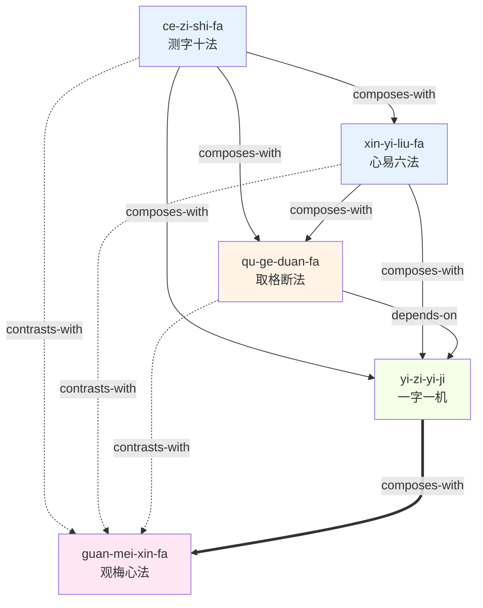

# 《测字秘牒》— Skill Index

> 本书由 cangjie-skill 蒸馏, 共产出 **5** 个 skills。
> 处理时间: 2026-07-29

## 关于这本书

- **作者**: （清）程省
- **出版年**: 清代（具体年份不详）
- **一句话主旨**: 系统整理汉字拆解占卜的十种方法、六种心法和大量断语格例，使测字术从零散经验变为可学习、可传承的完整术数体系。
- **整书理解**: 见 [BOOK_OVERVIEW.md](./BOOK_OVERVIEW.md)
- **术语词典**: [GLOSSARY.md](./GLOSSARY.md)

---

## Skill 列表 (按主题分组)

### 操作层（字形怎么拆）

- [`ce-zi-shi-fa`](./ce-zi-shi-fa/SKILL.md) — 测字十法：装头/接脚/穿心/包笼/破解/添笔/减笔/对关/摘字/观梅，字形操作的完整工具箱
- [`xin-yi-liu-fa`](./xin-yi-liu-fa/SKILL.md) — 心易六法：象形/会意/假借/谐声/指事/转注，字义变化的深层逻辑

### 判断层（吉凶怎么断）

- [`qu-ge-duan-fa`](./qu-ge-duan-fa/SKILL.md) — 取格断法：五行生克 + 六神动静，从字形分析到吉凶判断的最后一公里

### 心法层（境界怎么修）

- [`yi-zi-yi-ji`](./yi-zi-yi-ji/SKILL.md) — 一字一机：字同事不同、同字异断，情境唯一性原则
- [`guan-mei-xin-fa`](./guan-mei-xin-fa/SKILL.md) — 观梅心法：心镜光明、直觉感知，测字的最高境界

---

## 引用图



图例:
- `-->` / `===>` composes-with（配合使用）
- `-.->` contrasts-with（对比选择）
- `-->` depends-on（依赖前置）

---

## 推荐学习顺序

1. **测字十法** (ce-zi-shi-fa) — 最基础的操作工具箱，没有前置，先学十种字形操作
2. **心易六法** (xin-yi-liu-fa) — 在十法基础上，学六种字义推导的深层逻辑
3. **取格断法** (qu-ge-duan-fa) — 掌握操作和语义后，学五行六神的吉凶判断
4. **一字一机** (yi-zi-yi-ji) — 理解情境唯一性原则，防止照搬固定规则
5. **观梅心法** (guan-mei-xin-fa) — 最后修炼直觉感知，从"术"上升到"道"

> 前三个 skill 是"术"（可操作），后两个是"道"（需修炼）。先术后道，不可跳级。

---

## 安装使用

本目录是构建产物, 宿主不会从这里加载 skill。要让 agent 真正调用, 把 skill 目录复制到宿主的 skills 目录:

```bash
# 用户级 (所有项目可用)
cp -r ce-zi-shi-fa ~/.openclaw/skills/

# 或项目级
cp -r ce-zi-shi-fa <project>/.openclaw/skills/
```

---

## 审计轨迹

- 候选单元池: [candidates/](./candidates/)
- 被淘汰的候选 (含原因): [rejected/](./rejected/)
- 三重验证结果: [verified.md](./verified.md)
- 流水线状态: [PIPELINE_STATE.md](./PIPELINE_STATE.md)
