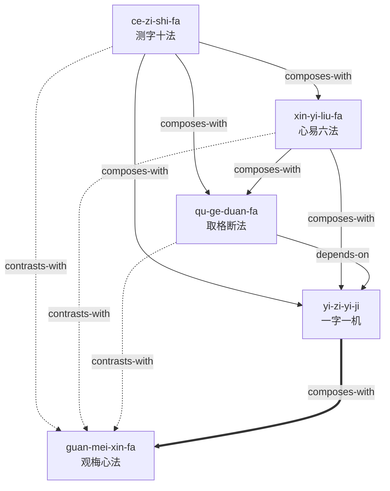

# 《测字秘牒》蒸馏 Skills

> 清代程省《测字秘牒》的方法论蒸馏，由 cangjie-skill 自动拆解为 5 个可被 AI agent 调用的 skills。

## 这是什么

这是一组从古籍《测字秘牒》中蒸馏出来的**可执行 skills**。不是书摘，不是读后感，而是可以直接被 AI agent 调用的方法论工具。

每个 skill 包含：
- **R**（原文引用）— 方法论的原始出处
- **I**（方法论骨架）— 用自己的话重写的核心逻辑
- **A1**（书中案例）— 作者亲自用过的案例
- **A2**（触发场景）— 什么情况下该调用这个 skill
- **E**（可执行步骤）— 1-2-3 步骤
- **B**（边界）— 什么时候不要用

## 5 个 Skills

| Skill | 描述 | 核心内容 |
|-------|------|---------|
| [`ce-zi-shi-fa`](./ce-zi-shi-fa/) | **测字十法** | 装头/接脚/穿心/包笼/破解/添笔/减笔/对关/摘字/观梅 — 字形操作的完整工具箱 |
| [`xin-yi-liu-fa`](./xin-yi-liu-fa/) | **心易六法** | 象形/会意/假借/谐声/指事/转注 — 字义变化的深层逻辑 |
| [`qu-ge-duan-fa`](./qu-ge-duan-fa/) | **取格断法** | 五行生克 + 六神动静 — 从字形到吉凶判断的最后一公里 |
| [`yi-zi-yi-ji`](./yi-zi-yi-ji/) | **一字一机** | 字同事不同、同字异断 — 情境唯一性原则 |
| [`guan-mei-xin-fa`](./guan-mei-xin-fa/) | **观梅心法** | 心镜光明、直觉感知 — 测字的最高境界 |

## 推荐学习顺序

```
1. 测字十法 → 2. 心易六法 → 3. 取格断法 → 4. 一字一机 → 5. 观梅心法
```

前三个是"术"（可操作），后两个是"道"（需修炼）。先术后道，不可跳级。

## 文件结构

```
ce-zi-mi-die-skills/
├── README.md              ← 你在这里
├── INDEX.md               ← Skill 总览 + 引用图（mermaid）
├── GLOSSARY.md            ← 共享术语词典（40 条）
├── DIGEST.md              ← 精华长文（不想读原书看这篇）
├── BOOK_OVERVIEW.md       ← 整书理解（阶段 0 产出）
├── ce-zi-shi-fa/          ← 测字十法
│   ├── SKILL.md
│   ├── test-prompts.json
│   └── test-results.md
├── xin-yi-liu-fa/         ← 心易六法
├── qu-ge-duan-fa/         ← 取格断法
├── yi-zi-yi-ji/           ← 一字一机
└── guan-mei-xin-fa/       ← 观梅心法
```

## 如何使用

### 方式 1：直接安装到 AI agent

把 skill 目录复制到你的 agent 的 skills 目录：

```bash
# OpenClaw
cp -r ce-zi-shi-fa ~/.openclaw/skills/

# Claude Code
cp -r ce-zi-shi-fa ~/.claude/skills/

# Cursor
cp -r ce-zi-shi-fa <project>/.cursor/skills/
```

### 方式 2：只看精华

不想装 skill，只想了解测字术？直接读 [DIGEST.md](./DIGEST.md)。

### 方式 3：接入 darwin-skill 自动进化

所有 skill 均带有 `test-prompts.json`（darwin-skill 兼容格式），可直接接入自动进化：

```
darwin evolve ce-zi-mi-die-skills/
```

## 引用图



## 来源

- **原书**：《测字秘牒》（清）程省 著
- **蒸馏工具**：[cangjie-skill](https://github.com/anthropics/cangjie-skill) — 把一本书蒸馏成一组可执行 skills 的元 skill
- **蒸馏时间**：2026-07-29

## 免责声明

本项目仅供文化研究和娱乐用途。测字术属于中国传统术数文化，其方法论不构成任何决策建议。

## License

MIT
